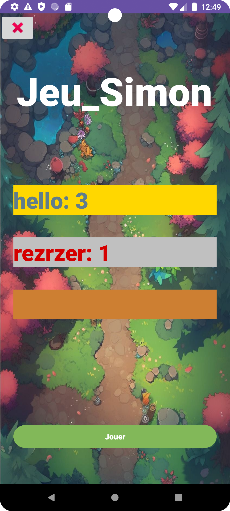
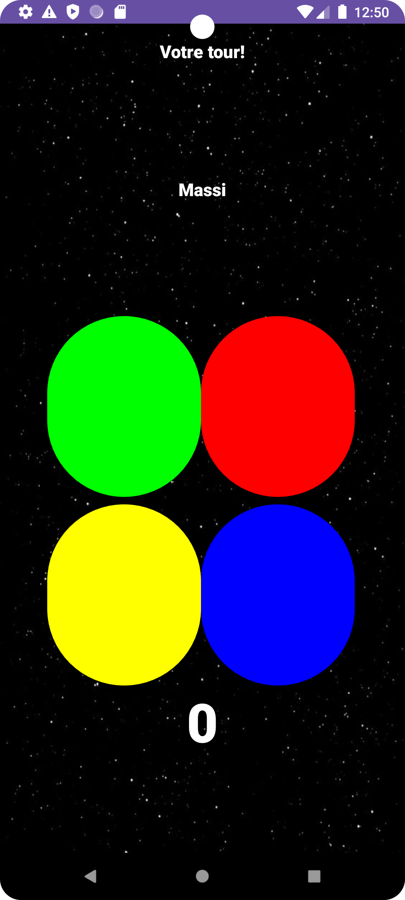

# Jeu du Simon - Android

## Description
Le jeu du Simon est un jeu de mémoire où le joueur doit reproduire une séquence de couleurs et de sons. À chaque tour, la séquence s'allonge, et la vitesse de présentation des couleurs augmente. Le but du jeu est de mémoriser la séquence et de la répéter correctement. Si le joueur se trompe, il doit recommencer à zéro.

Cette application Android recrée ce jeu classique avec une interface simple et intuitive.

## Fonctionnalités
- **Séquence aléatoire de couleurs et sons** : Le jeu génère une séquence de couleurs aléatoires à chaque tour.
- **Augmentation de la difficulté** : À chaque tour réussi, la séquence s'allonge et les délais entre les couleurs diminuent pour augmenter la difficulté.
- **Système de score** : Les scores sont enregistrés localement, et les meilleurs scores sont affichés.
- **Retour sonore et visuel** : Chaque couleur est associée à un son et une couleur de fond qui changent lorsqu'elles sont activées.

## Prérequis
- Android Studio pour l'édition et l'exécution de l'application.
- Un appareil Android ou un émulateur pour tester l'application.
- La version Android minimale requise est **Android 4.1 (Jelly Bean)**.

## Installation

1. Clonez ce dépôt ou téléchargez-le sur votre machine.
2. Ouvrez le projet dans **Android Studio**.
3. Compilez et exécutez l'application sur un appareil ou un émulateur Android.

   ```bash
   git clone https://github.com/yourusername/jeu_simon.git
   cd jeu_simon
## Images


